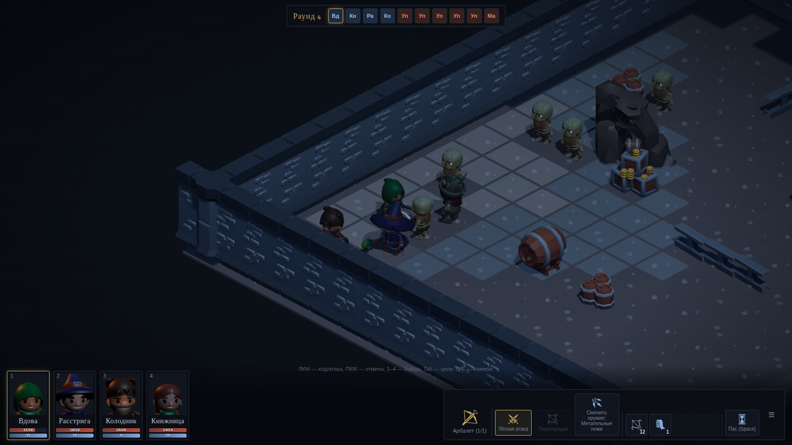
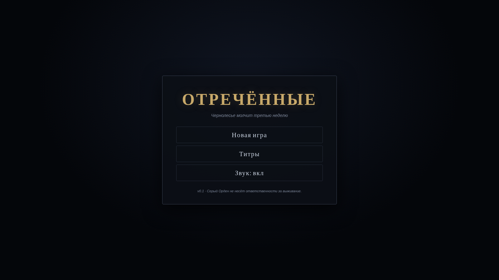
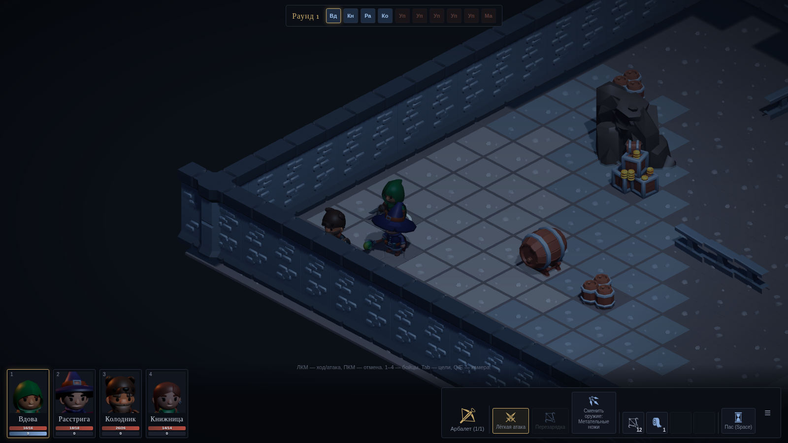
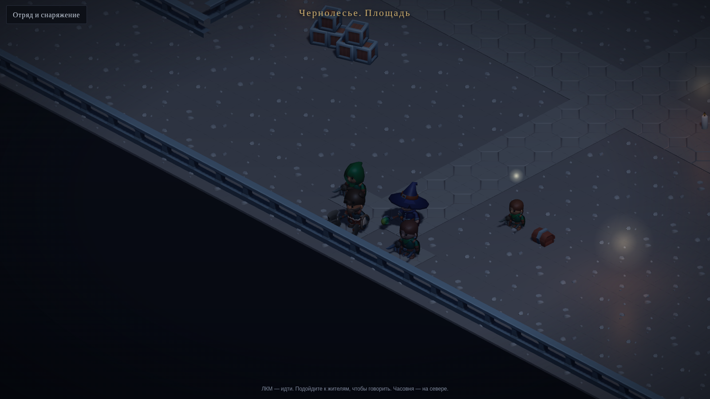
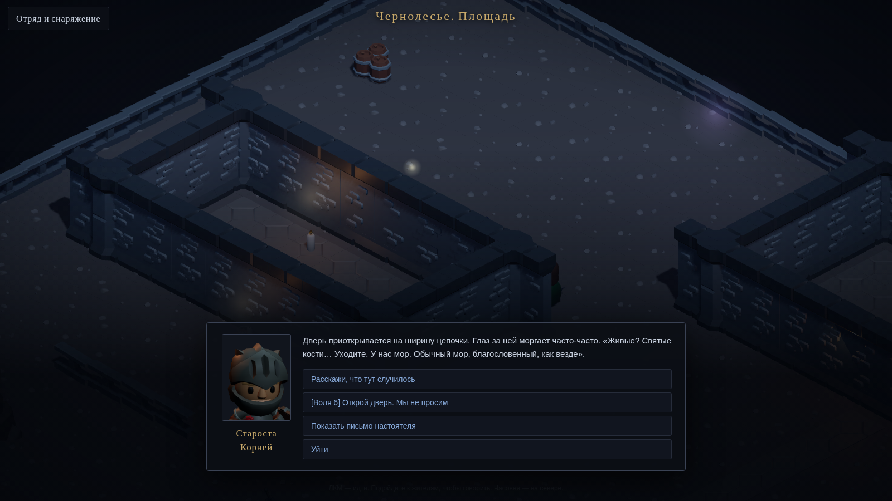
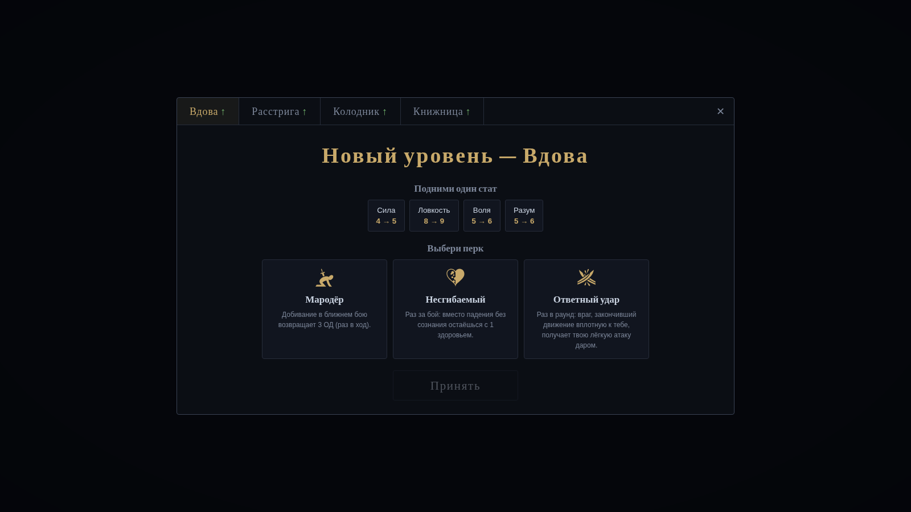
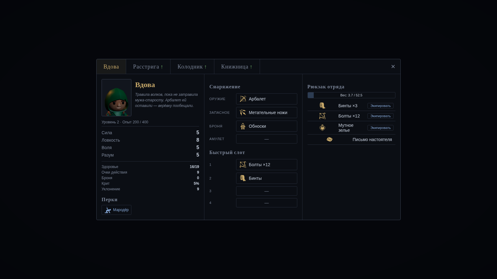
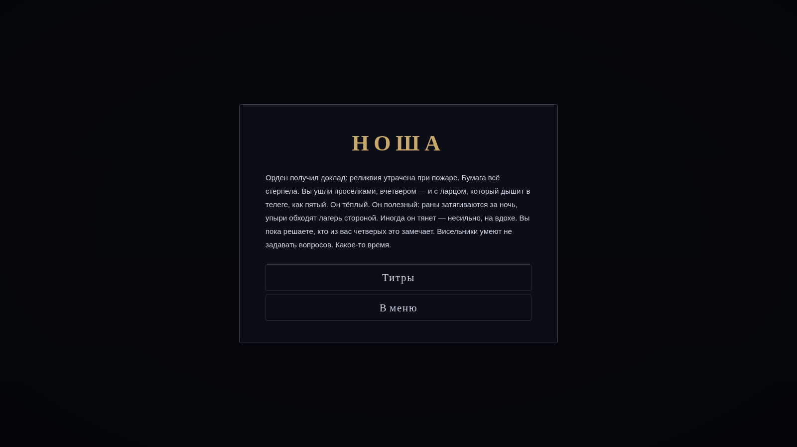
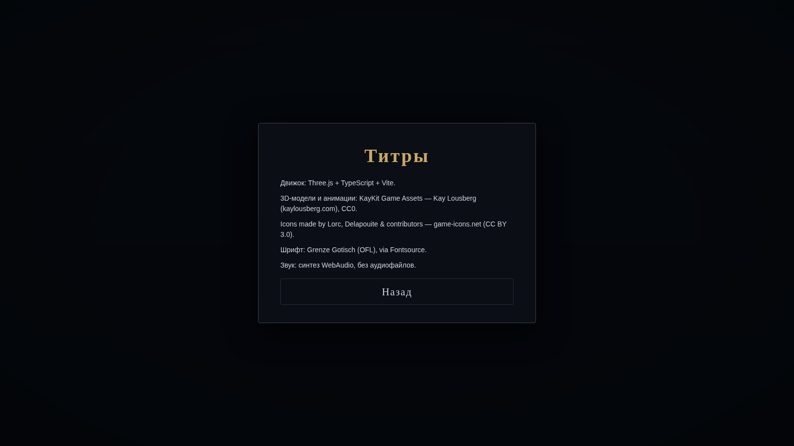

# ОТРЕЧЁННЫЕ

> Чернолесье молчит третью неделю. Отряд из четырёх осуждённых получает отсрочку петли
> за грязную работу Серого Ордена. Выяснить, почему деревня замолчала, — или повиснуть.

Браузерная пошаговая отрядная тактика-RPG в тёмном фэнтези — в духе ранних Fallout,
Jagged Alliance и XCOM. Настоящее 3D с изометрической камерой: Three.js + TypeScript + Vite,
без игровых движков поверх и без React.



## Статус разработки

| Майлстоун | Состояние |
|---|---|
| **М1 «Сцена и бой»** | ✅ готов |
| **М2 «RPG»** | ✅ готов |
| **М3 «Сюжет»** | ✅ готов |
| **М4 «Полировка»** | ✅ готов |

Полное техзадание: [docs/TZ.md](docs/TZ.md).

### Что уже работает (М1)

- Уровень собран из **KayKit Dungeon Remastered**: автотайлинг стен, пол инстансингом,
  укрытия (бочки/ящики/изгороди), декор, двери.
- Свет и атмосфера: холодный лунный directional с мягкими тенями, тёплые мерцающие факелы,
  FogExp2, тонмаппинг ACES, виньетка, ореолы света вместо bloom.
- Реальные модели юнитов (KayKit Adventurers / Skeletons) с анимациями
  idle/ходьба/атаки/выстрел/урон/смерть через AnimationMixer; оружие — отдельный меш
  в кости `handslot.r`; перекраска палитр под фракции (отречённые, упыри).
- Тактика: сетка, ОД, LOS лучом, туман войны (неразведанное черно, вне LOS — затемнено,
  враги скрыты), укрытия с щитками как в XCOM, фланкирование, шанс попадания **до** атаки
  с разбивкой, криты, статусы (кровотечение/горение/оглушение), AoE-огонь 3×3 с частицами.
- Бой 1: отряд 4 vs 6 упырей; победа/поражение; рестарт без перезагрузки страницы.
- ИИ: приоритет целей (раненые > фланг > ближайший), резервирование клеток, правило укрытия.
- Стены, заслоняющие бойцов, плавно просвечивают; Q/E — 4 ракурса камеры; зум колесом.
- Детерминированный сидируемый бой (`?seed=...` в URL); звук — синтез WebAudio (дрон, удары, UI).
- Юнит-тесты: LOS, путь, шанс попадания, движок боя (31 тест, vitest).

### Что уже работает (М2)

- Кампания: отряд живёт между боями, общий рюкзак с лимитом веса от суммарной Силы.
- Опыт за бои; левел-ап: +1 стат на выбор и перк из трёх предложенных (пул — 12 перков,
  каждый меняет глагол действия, триггер или выбор с ценой — ни одного плоского бонуса).
- Лист персонажа: вкладки бойцов, слоты (оружие/запасное/броня/амулет/4 быстрых),
  биографии, травмы, перки, тултипы у всего.
- Обыск тел и сундуков в бою (экран лута), дроп с врагов, квестовое письмо после Боя 1.
- Сейв/лоад: автосейв, сохранение посреди боя (восстанавливается всё — позиции, ОД,
  туман войны, огонь, двери), экспорт/импорт сейва строкой (Ctrl+I в меню).
- Травмы: упавший без сознания боец встаёт после победы со штрафом −1 к стату навсегда.

### Что уже работает (М3)

- Диалоговая система data-driven: узлы с текстом, опциями, условиями по флагам и
  предметам, чеками статов («[Воля 6] Надавить»), последствиями (флаги, опыт, предметы,
  смена сцены). Портрет говорящего — рендер бюста модели в RenderTarget.
- Сюжет пролога: вход в Чернолесье → деревня с тремя NPC (староста-трус, безумная
  травница, мальчишка-свидетель) → часовня → реликвия.
- Режим исследования: отряд цепочкой ходит по деревне, NPC с маркерами, дверь часовни.
- **Бой 2 избегается** целиком (предъявить письмо настоятеля) или ослабляется
  (чек Воли/Разума — культисты дрогнут, останутся двое).
- Финал — три выбора (сдать Ордену / уничтожить / оставить себе), три текстовых эпилога;
  «уничтожить» запускает бой с настоятелем в усиленной эмиссивной форме.
- Виньетка проходится двумя принципиально разными путями: силой и словами.

### Что уже работает (М4)

- ИИ врага по всем правилам ТЗ: приоритет целей (раненые → фланг → ближайший),
  правило укрытия (стрелок не кончает ход в открытом поле), фланговый обход
  ближников с резервированием клеток, алхимик бьёт огнём по скоплению 2+,
  мораль (гибель вожака — рядовые с Волей < 4 теряют ход).
- Звук — синтез WebAudio: дрон-эмбиент с ветром, удары/выстрелы/взрывы, щелчки UI,
  стинги победы и поражения; кнопка mute (состояние сохраняется).
- Экран титров с полной атрибуцией (KayKit CC0, game-icons CC BY 3.0, шрифт OFL).
- Карта-хаб деревни — 48×32; пол, изгороди и укрытия рендерятся через `InstancedMesh`,
  чтобы держать число вызовов отрисовки низким.
- Тесты: 45 юнитов (vitest) + Playwright-смоук (грузится, бой стартует, ход
  совершается, сейв и возобновление посреди боя, виньетка добегает до эпилога) —
  с проверкой пустой консоли.
- Деплой на GitHub Pages через GitHub Actions.

### Скриншоты

| Меню | Начало боя |
|---|---|
|  |  |
| Деревня Чернолесье (48×32) | Диалог |
|  |  |
| Левел-ап | Лист персонажа |
|  |  |
| Эпилог | Титры |
|  |  |

### Производительность

Обязательный для тайлов пола `InstancedMesh` — на месте: 1536 клеток деревни
рисуются считанными инстансами на вариант, изгороди и бочки/ящики тоже инстансятся.
Низкополигональные модели KayKit, одна карта теней. На железе с GPU сцена держит 60 fps.
Замер FPS внутри headless-CI **не репрезентативен**: там работает программный растеризатор
SwiftShader (без GPU), поэтому числа кадров оттуда не показатель.

## Запуск

```bash
npm install
npm run dev       # http://localhost:5173
npm test          # юнит-тесты движка (vitest)
npm run test:e2e  # Playwright-смоук (поднимает preview сам)
npm run build     # production-сборка в dist/
```

Управление: ЛКМ — ход/атака, ПКМ — отмена, 1–4 — бойцы, Tab — перебор целей,
Space — пас, Q/E — поворот камеры, колесо — зум, WASD/стрелки — панорама, Esc — меню.
Импорт сейва строкой — Ctrl+I в главном меню.

## Архитектура

```
src/
  core/    — ГПСЧ (mulberry32, сериализуемый), i18n
  game/    — чистая игровая логика без рендера: сетка, LOS, поиск пути,
             движок боя (события), ИИ, юниты
  data/    — контент: предметы, юниты, перки, карты (ascii), все строки
  render/  — Three.js: сцена/камера, загрузчик KayKit-ассетов с фоллбеком,
             юниты, тактическая разметка, туман войны, эффекты, портреты
  ui/      — HUD, экраны (DOM/CSS)
  audio/   — синтез WebAudio
tests/     — vitest: LOS, путь, бой
```

Логика боя детерминирована и не знает о рендере: каждое действие возвращает
список событий, которые слой отображения проигрывает очередью.

## Ассеты и лицензии

- 3D-модели и анимации: **KayKit Game Assets** — Kay Lousberg (kaylousberg.com), CC0.
- Иконки: **Icons made by Lorc, Delapouite & contributors — game-icons.net (CC BY 3.0)**.
- Шрифт: Grenze Gotisch (OFL) через Fontsource.
- Звук: синтез WebAudio, аудиофайлов нет.

## Деплой

GitHub Actions собирает Vite-проект (`GHPAGES=1` ставит base `/step/`) и публикует
`dist/` на GitHub Pages при пуше в `main` — workflow в `.github/workflows/deploy.yml`.
CI (`.github/workflows/ci.yml`) на каждый пуш гоняет tsc, юнит-тесты, сборку и Playwright-смоук.

> **Pages включается вручную один раз:** Settings → Pages → Source = «GitHub Actions».
> Workflow деплоя срабатывает по пушу в `main`, поэтому ветку нужно слить в `main`,
> либо запустить деплой вручную через «Run workflow» (`workflow_dispatch`).
